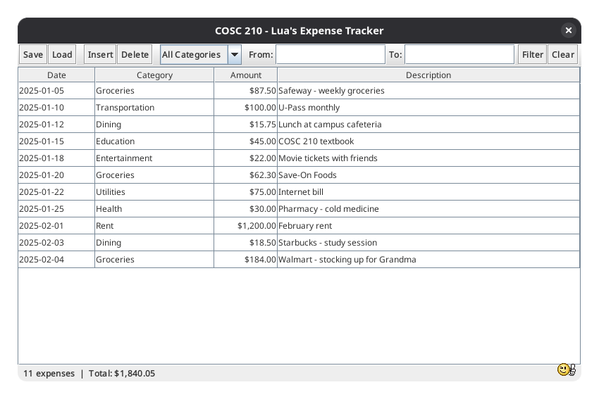
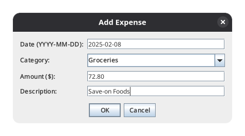

# COSC 210 Budgeting & Expense Tracking Application

This repository contains my 2026W2 COSC 210-101 Software Construction term project.
I'm going to be developing a simple budgeting and expense tracking application.

## Team

Per Professor Gema Rodriguez-Perez's instructions, I will be working alone on this project.

Author: Lua MacDougall

## Requirements

Per the assignment, this project has the following requirements:
* Must be written in Java
* Must be a desktop application
* After phase 1, the application will have a console-based interface
* After phase 2, the application will be able to save and restore it's entire state
* After phase 3, the application will have a graphical user interface
* Must have a well-defined and sensical data model with non-trivial classes and methods
* Must utilize some kind of collection with an arbitrary number of elements
* Must have complex control flow (loops, branches, nested structures, etc.)
* Must provide solutions to the user stories

Additionally, the application must not be some simple clone of a project that has been provided to me or some commonly known game. I will aim to develop a unique and innovative application that meets the requirements and provides a valuable solution to the user.

## Project

The application will be a simple budgeting and expense tracking application. It will allow users to track expenses and view their spending habits. The application will be able to save and restore its entire state, and will *(eventually)* have a graphical user interface.

It will have the following basic functions:
* Create an expense with a date, category, amount, and description *(e.g. "Feb 10th - Grocery - $100 at the Save-On")*
* Edit an expense's fields *(e.g. change the category or amount)*
* Delete an expense
* View the list of expenses
* View a summary of expenses by category *(e.g. grocery, entertainment, etc.)*
* View a summary of expenses by date range *(e.g. the last month)*
* Calculate the total expenses for a given date range
* Calculate the total expenses for a given category and date range

I will target a specific audience: students. I will focus on creating a user-friendly interface and intuitive features that cater to the needs of students who are managing their finances and are stretched by the cost of living, like myself!

This project is of interest to me as it would be nice to have a simple desktop application that can help me manage my expenses and stay within my budget, instead of relying on confusing Google Sheets spreadsheets that are difficult to use and prone to errors.

## User Stories

I've compiled a list of user stories that will guide the development of this project:

1. As a user, I want to be able to add an **expense** with a <ins>date</ins>, <ins>category</ins>, <ins>amount</ins>, and <ins>description</ins> to my **expense tracker**
2. As a user, I want to be able to view a list of all my **expenses**
3. As a user, I want to be able to edit an existing **expense**'s fields *(<ins>date</ins>, <ins>category</ins>, <ins>amount</ins>, or <ins>description</ins>)*
4. As a user, I want to be able to delete an **expense** from my **expense tracker**
5. As a user, I want to be able to view a summary of my **expenses** grouped by <ins>category</ins>
6. As a user, I want to be able to view my total spending within a specific date range *(<ins>date</ins>)*
7. As a user, I want to be able to filter my **expenses** by <ins>category</ins> and date range *(<ins>date</ins>)* to see targeted spending summaries
8. As a user, I want to be able to save my **expenses** and **expense tracker** to a file for later usage
9. As a user, I want to be able to load up my previously saved **expenses** and **expense tracker** to continue tracking my finances without re-entering information

Note that I've highlighted elements of the user stories for easy identification.
- Classes are bolded
- Class fields are underlined

As this is a solo project, I *(Lua)* will be responsible for implementing all the features outlined in the user stories.

## Instructions for End User

You can view the panel that displays the **expenses** that have already been added to the **expense tracker** simply by opening the application.
You will be presented with a window that looks like this:

The current **expense tracker** is displayed in a spreadsheet-like format.
You can select an **expense** by clicking on it.
You can also filter the **expense tracker** by selecting a category or date range.

Note the buttons across the top of the window. This is the application's toolbar.

Using these buttons, you can perform a number of operations:
* **\[Save\]** - Opens a file dialog to save the **expenses** and **expense tracker** to a file for later usage, as a .json file
* **\[Load\]** - Opens a file dialog to load up your previously saved **expenses** and **expense tracker**, from a .json file
* **\[Insert\]** - Opens a form dialog that, once filled out with the correctly formatted values, adds an **expense** to the **expense tracker**
* **\[Delete\]** - Deletes the selected **expense** from the **expense tracker**
* **\[Filter\]** - Filters the **expense tracker** by a date range. You'll need to input two dates in the format "YYYY-MM-DD" into the "From:" and "To:" fields.
* **\[Clear\]** - Clears the date range filter if it's currently applied

Note the category filter box. If you select a category, only expenses with that category will be displayed.

As for the form dialog that appears when you click the **\[Insert\]** button, it'll look something like this:

To insert an **expense** into the **expense tracker**, you'll need to input the following values:
* **Date:** The date of the expense,
* **Category:** The category of the expense,
* **Amount:** The amount of the expense,
* **Description:** A description of the expense.

Of course, you can also edit the values of an existing **expense** by clicking on it in the spreadsheet-like view.
Your changes will be written into the **expense tracker**.

Once you've finished adding expenses, you can save your **expense tracker** to a file by clicking the **\[Save\]** button.
You can load up your previously saved **expense tracker** by clicking the **\[Load\]** button.

Finally, please note the funny little thumbs up emoji in the bottom right corner of the main window.
He's there to encourage you and reassure you that everything is going to be okay!
Financial stress can be super difficult, especially as a student, so it's nice to have a little encouragement.
